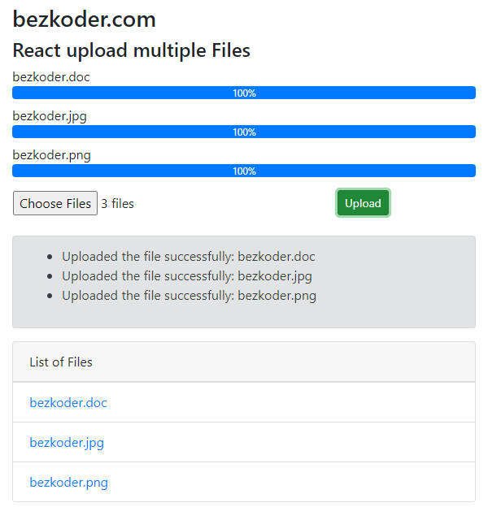

## React Multiple Files upload example with Progress Bar

We’re gonna create a React Multiple Files upload application in that user can:

- see the upload process (percentage) of each file with progress bars
- view all uploaded files
- download link to file when clicking on the file name



For more detail, please visit:
> [React Multiple Files upload example with Progress Bar](https://bezkoder.com/react-multiple-files-upload/)

> [React (with Hooks) Multiple Files upload example](https://bezkoder.com/react-hooks-multiple-file-upload/)

Rest APIs server for this React Client:
> [Node.js Express File Upload Rest API example](https://bezkoder.com/node-js-express-file-upload/)

> [Node.js Express File Upload with Google Cloud Storage example](https://bezkoder.com/google-cloud-storage-nodejs-upload-file/)

> [Spring Boot Multipart File upload example](https://bezkoder.com/spring-boot-file-upload/)

More Practice:
> [React Pagination example](https://bezkoder.com/react-pagination-material-ui/)

> [React File Upload example](https://bezkoder.com/react-file-upload-axios/)

> [React JWT Authentication & Authorization example](https://bezkoder.com/react-jwt-auth/)

> [React + Redux: JWT Authentication & Authorization example](https://bezkoder.com/react-redux-jwt-auth/)

Fullstack with Node.js Express:
> [React.js + Node.js Express + MySQL](https://bezkoder.com/react-node-express-mysql/)

> [React.js + Node.js Express + PostgreSQL](https://bezkoder.com/react-node-express-postgresql/)

> [React.js + Node.js Express + MongoDB](https://bezkoder.com/react-node-express-mongodb-mern-stack/)

Fullstack with Spring Boot:
> [React.js + Spring Boot + MySQL](https://bezkoder.com/react-spring-boot-crud/)

> [React.js + Spring Boot + PostgreSQL](https://bezkoder.com/spring-boot-react-postgresql/)

> [React.js + Spring Boot + MongoDB](https://bezkoder.com/react-spring-boot-mongodb/)

Fullstack with Django:

> [React.js + Django Rest Framework](https://bezkoder.com/django-react-axios-rest-framework/)

Serverless:
> [React Firebase CRUD App with Realtime Database](https://bezkoder.com/react-firebase-crud/)

> [React Firestore CRUD App example | Firebase Cloud Firestore](https://bezkoder.com/react-firestore-crud/)

Integration (run back-end & front-end on same server/port)
> [Integrate React with Spring Boot](https://bezkoder.com/integrate-reactjs-spring-boot/)

> [Integrate React with Node.js Express](https://bezkoder.com/integrate-react-express-same-server-port/)

This project was bootstrapped with [Create React App](https://github.com/facebook/create-react-app).

### Set port
.env
```
PORT=8081
```

## Project setup

In the project directory, you can run:

```
npm install
# or
yarn install
```

or

### Compiles and hot-reloads for development

```
npm start
# or
yarn start
```

Open [http://localhost:8081](http://localhost:8081) to view it in the browser.

The page will reload if you make edits.
